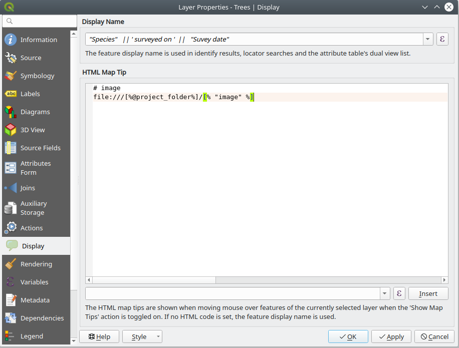
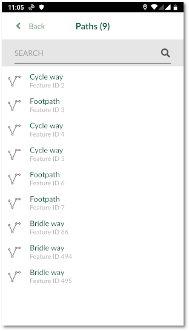

<!--- IMPORTANT: This permlink is referenced from InputApp -->

In Input app, in addition to viewing map data, you can view and search attribute forms related to your data or non-spatial tables within your project.

# QGIS project configuration

To be able to view the attribute table of a layer, you need to first configure your [QGIS project](https://docs.qgis.org/3.10/en/docs/user_manual/introduction/qgis_configuration.html?highlight=properties#data-sources-properties):

- Open QGIS Desktop with you QGIS Project
- In the Menu > Project > Properties click on "Data Sources"

- Under **Identifiable** column, select the layers you'd like to browse the attribute forms.

Input app, only displays a summary of the table for all the data. By default, it shows the first column as the header for summary of the field. To change that, you can set the [**Display Name**](https://docs.qgis.org/3.10/en/docs/user_manual/working_with_vector/vector_properties.html#display-properties)

# Brows data forms in Input
You can now open the attribute table in Input, by:

- Open a project in Input
- From the lower menu, select **(More)** > **Browse feature**
- Select the layer/table from the list

The attribute table should appear:

