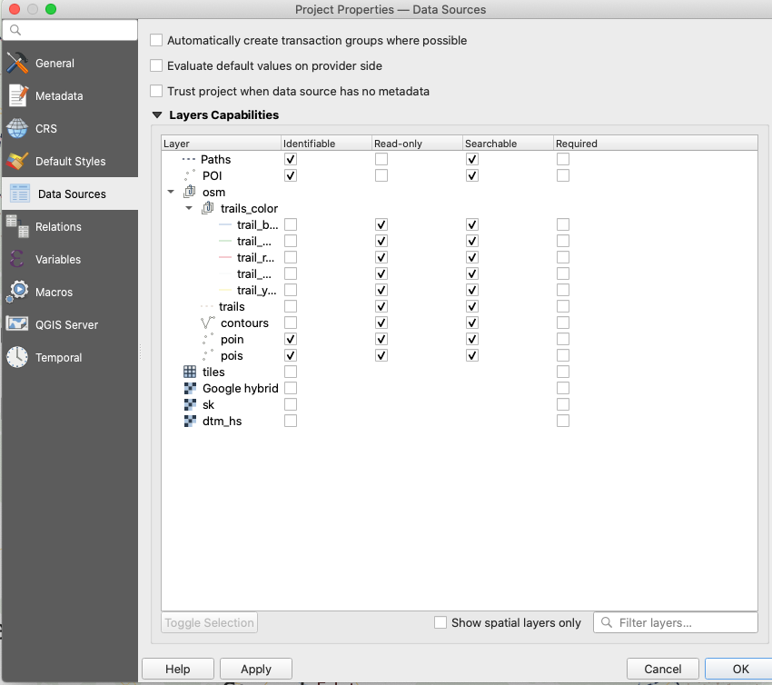

<!--- IMPORTANT: This permlink is referenced from InputApp -->

# Enable Browsing

- Open QGIS Desktop with you QGIS Project 
- In the Menu>Project>Properties click on "Data Sources"

- You need to have at least one layer with "Identifiable" check
- Save the project 
- Resync the project back to your device
