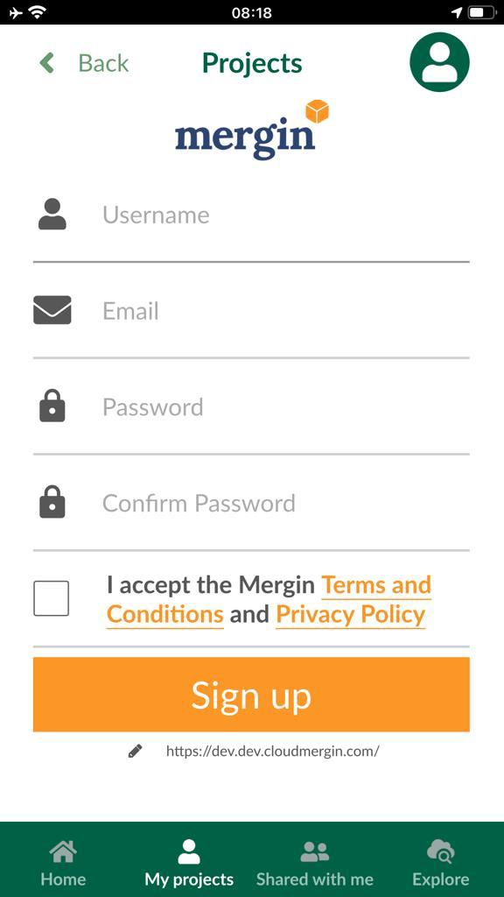

# Registration

1. Launch the Input app from your mobile/tablet device

2. Select **Home**

3. On the top right of the screen,select the icon for profile

4. In the new page, select **Sign up**

5. Fill in the form for registration and select **Sign up**

	

6. You will receive an email to activate your account. You can follow the instructions in the mail to verify your account (optional)

7. You can sign in to your Mergin account

Alternatively, you can sign up to the Mergin service, through [Mergin website](https://help.cloudmergin.com/registration.html)
