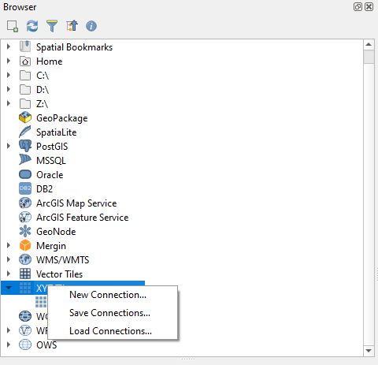
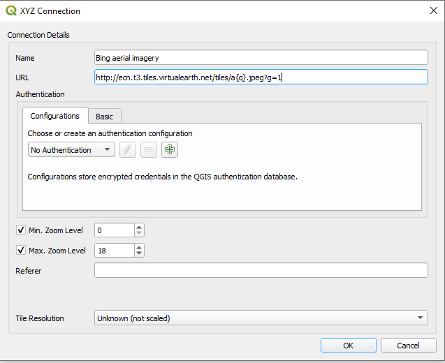
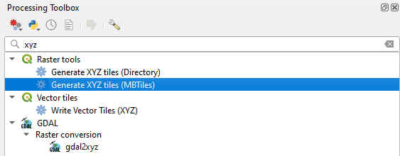
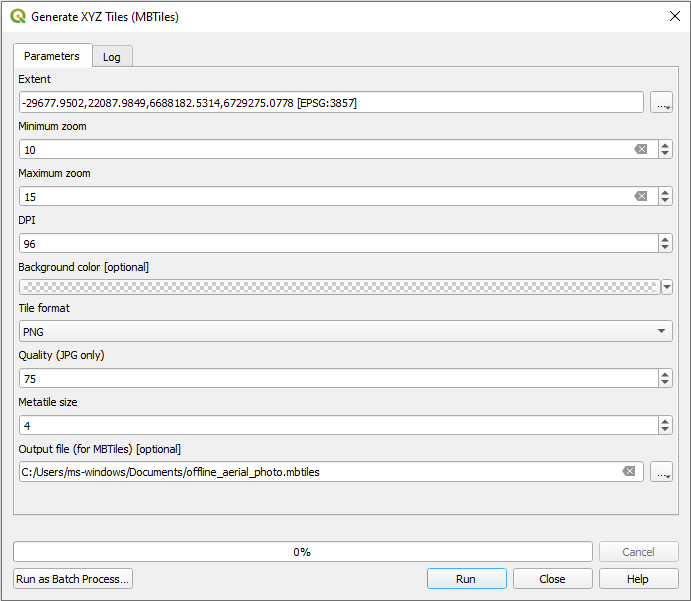

# Raster tiles
Raster tiles can be large in size but an ideal format for aerial imagery.

## Online services

[QGIS comes by default with the OpenStreetMap online services for XYZ tiles](https://docs.qgis.org/3.10/en/docs/user_manual/managing_data_source/opening_data.html?highlight=xyz#using-xyz-tile-services). When adding cartographic basemap, ensure you set the tile size correctly, so that the texts and labels are readable on mobile devices with high resolution display.

You can also add [other sources](https://gis.stackexchange.com/questions/20191/adding-basemaps-from-google-or-bing-in-qgis/217670#217670) of XYZ tiles to your QGIS.

To add Bing aerial imagery to your QGIS:

- Open QGIS
- From the Browser panel, right-click on **XYZ Tiles** and select **New Connection ...**
- A new window will appear:
  - For **Name** type **Bing aerial imagery**
  - For **URL** type *http://ecn.t3.tiles.virtualearth.net/tiles/a{q}.jpeg?g=1*
  - Press OK

**Bing aerial imagery** should appear under your **XYZ Tiles**:
- From the **Browser panel**, double click on **Bing aerial imagery** under **XYZ Tiles**
- Zoom to the extent of your study area

## Generating raster tiles

QGIS also offers a [processing algorithm](https://docs.qgis.org/3.10/en/docs/user_manual/processing_algs/qgis/rastertools.html) to generate [your own XYZ tiles](https://ocw.un-ihe.org/mod/book/tool/print/index.php?id=5497&chapterid=491) for offline use.

To generate a raster tile covering the aerial photography of your survey area:

  - Add the Bing aerial imagery link added above
  - Zoom to your study extent

To generate an offline copy of the aerial imagery from your map view extent:

  - In QGIS, from the main menu, select **Processing** > **Toolbox**
  - A new panel should appear on the right side of your QGIS
  - In the search section on the top of the **Processing** panel, type **xyz**
  - Under **Raster**, double-click on **Generate XYZ tiles (MBTiles)**
  - A new window will appear:
    - For **Extent**, click on the right-side drop-down menu and select **Use Map Canvas Extent**
    - For **Minimum zoom**, type **10**
    - For **Maximum zoom**, type **15**
    - For **Output file (for MBTiles)**, click on the right side drop-down menu and select **Save to file**
    - Browse the folder where you want to save **offline_aerial_photo.mbtiles**
    - Click **Run**

Notes:
  - Depending on the size of your study area, the output file can grow significantly
  - Choosing higher zoom level (in the example above, **15** was selected) can result in a very large file
