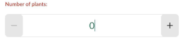
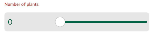
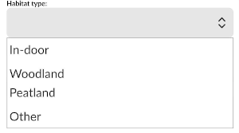
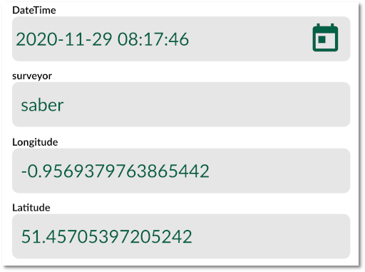

**Note**: You can follow the examples in this section using [this project](https://public.cloudmergin.com/projects/documentation/form_setup/tree).

When capturing geo-data, it is often required to fill in a form related to the surveyed point, line or area. The forms set up can simplifying filling the data and can also ensure the correct information is populated.

Input supports a number of edit widget types for forms such as: drop-down options, slider, date and time, checkbox, photos. In addition, extra configuration can be done to the fields and form layout, for example: setting a default value, conditional visibility and constrains.

Setting up forms can be configured using [QGIS widget types](https://docs.qgis.org/3.16/en/docs/user_manual/working_with_vector/vector_properties.html#edit-widgets).

In the sections below, we go through examples of setting up different widgets for forms in QGIS and Input:

## [Form layout](/howto/settingup_forms_layout)
To have multiple tabs with subgroups in your form (with conditional visibility) click [here](/howto/settingup_forms_layout):

## [Numeric field](/howto/settingup_forms_slider)

To use numeric fields using **Range** with **Slider** in your form, click [here](/howto/settingup_forms_slider):

## [Photos](/howto/settingup_forms_photos)

To use your device camera or existing photos from gallery to add a photo in a field, click [here](/howto/settingup_forms_photos):

## [Date and time](/howto/settingup_forms_datetime)

To use calendar widget to assign date and time to a field in your form, click [here](/howto/settingup_forms_datetime):

## [Checkbox](/howto/settingup_forms_checkbox)

To use checkbox for binary selection in a field, click [here](/howto/settingup_forms_checkbox)

## [Drop-down menu (value map)](/howto/settingup_forms_valuemap)

To have a drop-down menu with pre-defined values, click [here](/howto/settingup_forms_valuemap)

[Default value](/howto/settingup_forms_defaults):

To have pre-populated values within the field (e.g. name of the surveyor, date/time of the survey, latitude and longitude of the feature), click [here](/howto/settingup_forms_defaults):

## [Constraints](/howto/settingup_forms_constraints)
To enforce constraints on a field in your forms, click [here](/howto/settingup_forms_constraints)

## [Cascade or drill-down](/howto/settingup_forms_cascade)
To have a more complex form with drill-down menu option, click [here](/howto/settingup_forms_cascade)
