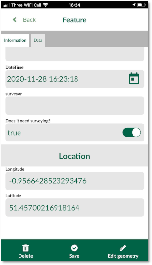
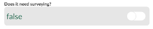

**Note**: You can follow the examples in this section using [this project](https://public.cloudmergin.com/projects/documentation/form_setup/tree).

When capturing geo-data, it is often required to fill in a form related to the surveyed point, line or area. The forms set up can simplifying filling the data and can also ensure the correct information is populated.

Input supports a number of edit widget types for forms such as: drop-down options, slider, date and time, checkbox, photos. In addition, extra configuration can be done to the fields and form layout, for example: setting a default value, conditional visibility and constrains.

Setting up forms can be configured using [QGIS widget types](https://docs.qgis.org/3.16/en/docs/user_manual/working_with_vector/vector_properties.html#edit-widgets).

In the sections below, we go through examples of setting up different widgets for forms in QGIS and Input:

## [Form layout](/howto/settingup_forms_layout)
For layouts can be configure to have multiple groups and subgroups. This will allow users to have a more organised way of grouping the fields. With conditional visibility, you can also turn the subgroups on and off:

In the above example, fields are grouped into 2 tabs: **Information** and **Data** with the **Location** subgroup was controlled by the state of **surveyed** field.

[For more information on how to setup the forms layout in QGIS see this section.](/howto/settingup_forms_layout)

## Text field

When you have a text field, the default widget to fill in the values are set automatically to be **Text edit** widget. You can configure the field to be able multiline text in QGIS:

## Numeric field

When you have an integer or a decimal filed, you can configure edit widget in QGIS and set it to **Range**:

## [Photos](/howto/settingup_forms_photos)

You can use your phone/tablet camera to take photos and attach them to a field. Alternatively, you can attach existing photos from your phone/tablet to a field.

To be able to use camera and photos in your form, you need to change edit widget type in QGIS to **Attachment**. Ensure you select **Relative** path for the attachment under the widget configuration in QGIS.

[For more information on setting this widget click here.](/howto/settingup_forms_photos)

## [Date and time](/howto/settingup_forms_datetime)

If one of your fields data type is **Date** or **Date and Time**, QGIS will automatically assigns **Date and Time** edit widget tool. This will allow you to select date and time using a calendar in Input:

**Tip**: you can set the default value for this widget in QGIS to *now()** and the current date will be recoded when you capture a feature.

[To learn more about setting date and time widget for your forms, click here.](/howto/settingup_forms_datetime)

## [Checkbox](/howto/settingup_forms_checkbox)

Checkbox is set by default in QGIS, if your data type is **Bolean**. You can also set the edit widget to have a binary choice in the form.

[For more information, see the detailed configuration in QGIS here.](/howto/settingup_forms_checkbox)

- [Slider](/howto/settingup_forms_slider)
- [Drop-down menu (value map)](/howto/settingup_forms_valuemap)
- [Default value](/howto/settingup_forms_defaults)
- [Constraints](/howto/settingup_forms_constraints)
- [Cascade or drill-down](/howto/settingup_forms_cascade)
