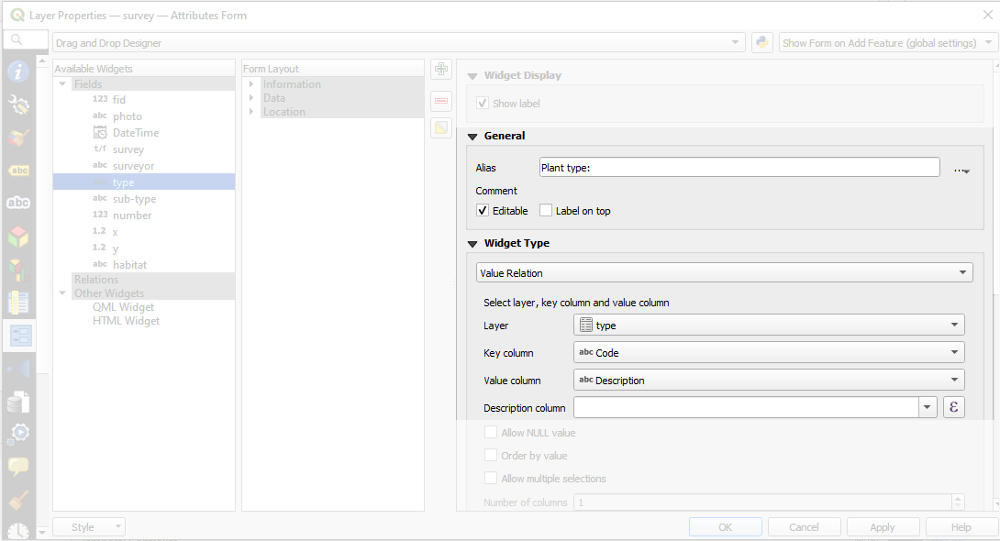
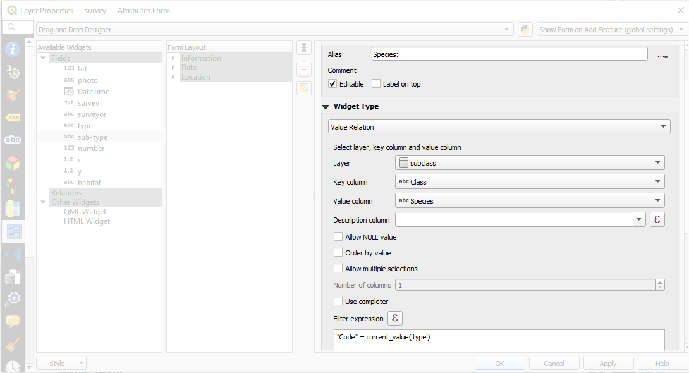
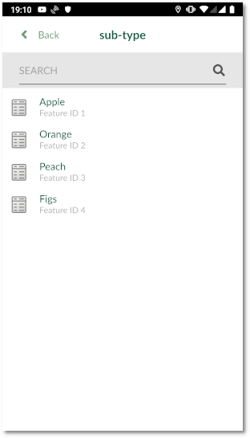

# Cascade or drill-down forms
Cascade or drill-down forms are the types of forms that the values listed in one field depend on the value selected in another feild.

In this example, we have two databases: one contains the type (e.g. fruit, vegetable, flower, etc) and another contains the species for each type (e.g. apple, orange, rose, tomato, etc). We are going to set up the form so that when user selects **type** only **sub-type** related to the type will be listed. For example, when user selects **Fruit** for **type**, the options will be limited to **Apple**, **Orange**, **Fig**, etc.

All the data for types and sub-types are stored within the Geopackage as **type** and **subclass** tables.

## QGIS

To set up a the cascde form:

  - Download and open [this example project](https://public.cloudmergin.com/projects/documentation/form_setup/tree) in QGIS
  - From the layer panel, right-click on **survey** layer and select **Properties**
  - In the new window, select **Attributes form**

  - Select **type** field under the right column (**Available Widgets**)
  - Under the **Widget Display**:
  - Under **General**, for **Alias** type **Plant type:**
  - Under **Widget Type** section:
    - From the drop-down menu, select **Value Relation**
    - Set the **Layer** to **type**
    - Set the **Key column** to **Code**
    - Set the **Value column** to **Description**
  - Select **sub-type** field under the right column (**Available Widgets**)
  - Under the **Widget Display**:
  - Under **General**, for **Alias** type **Species:**
  - Under **Widget Type** section:
    - From the drop-down menu, select **Value Relation**
    - Set the **Layer** to **subclass**
    - Set the **Key column** to **Class**
    - Set the **Value column** to **Species**
    - Under **Filter expression**, type: *"Code" = current_value('type')*
    - You can select **Allow multiple selection** if required
    

Ensure to save and synchronise your project.

## Input

To use the cascade form in Input:

- Open Input on your device and from **Projects** > **Explore** download **documentation\form_setup**
- Open the project
- Select **Record** and add a point
- The form will appear
- Under **Data** tab, for **Plant type:** select **Fruit**.
- **Species** field should short list only fruit values:

