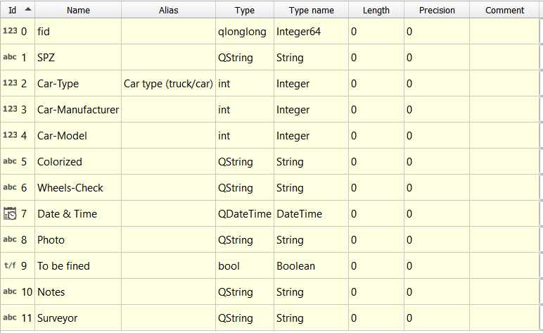
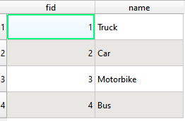

Cascade or drill-down forms are the types of forms that the values listed in one field depend on the value selected in another field.

In this [example](https://public.cloudmergin.com/projects/documentation/form_cascade/tree), we have multiple databases:
  - car-model
  - car-manufacturer
  - car-types
  - wheel-check
  - color

In the steps below, we will capture points representing **car** layer: the choices from the value relation will be filtered based on the previous field user picks. For example, if user selects **Trucks** as **Car type (truck/car)**, the **Car-Manufacturer** field will present user with **DAF Trucks**, **Scania** or **MAN**. Likewise, the next drop-down menu for **Car-Model** will change accordingly based on the **Car-Manufacturer** selection.

## QGIS

Below is a dataset named `car`, which is a point layer, with the following attributes:

The aim is to create an attribute form, where users can populate `Car-Type`, `Car-Manufacturer`, & `Car-Model` with information that is pre-defined.

Each of these fields are stored under a tab called `Survey` in the Form Layout view.

As well as the spatial data found in car, there are also several non-spatial tables, such as `car-type`, `car-manufacturer` & `car-model`. These are look-up tables that are going to be used to populate the forms as data entry takes place.

### Car type

The first field to deal with during data entry is `Car-type`. A Value Relation widget is used here, referring specifically to the `car-type` look-up table. The key column is set as the `fid` (a unique value for each row), and the value column is set to `name`:

The look-up table is structured as follows:

This means, that when entering data into this field, the user is presented with these four `name` values:

Note: `(no selection)` is an option because “Allow NULL value” has been checked in the Widget options.

### Car-manufacturer

The next field to populate is `Car-manufacturer`. The values in this field are dependent on the value selected in `Car-type`. Again, a Value Relation widget is used, with reference to the `car-manufacturer` look-up table. The key column is set to `fid` and the value column is set to `name`. Because the desired behaviour is for selectable values to be limited by the `Car-type`, an expression is used:

`"type" = current_value('Car-Type')` - is used to filter the look-up table (`car-manufacturer`) by the type field. The expression looks for the users current value in `Car-type`, takes that value, and uses it to filter the look-up table, leaving only features where the values match.

In order to get this relationship between look-up tables and the spatial data working correctly, a Value Relation widget also needs to be set up on the type field in the `car-manufacturer` look-up table:

Once, both the widgets for the field in the spatial data and associated look-up table are in place, the data entry process should now be working as a drill-down/cascading form:

Based on a selection of `Truck` for “Car type (truck/car)”, only three manufacturers are available to select.

### Car-model
This field works in an almost identical way to `Car-manufacturer` and demonstrates that more than one cascade/drill-down can be in place. It uses Value Relation widgets with the look-up table `car-model`.

## Input

To use the cascade form in Input:

- Open Input on your device and from **Projects** > **Explore** download **documentation\form_cascade**
- Open the project
- Select **Record** and add a point
- The form will appear
- Under **Survey** tab, for **Car-type** select **Car**.
- **Manufacturer** field should short list **Mercedes-Benz**, **Skoda** and **Audi**. Select **Audi**
- For **Car-Model** select **A8**

