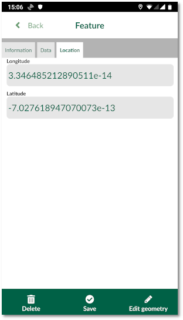

# Defaults and pre-defined values
You can set a default value for your fields. The default value can be a text, number or a QGIS expression. In the example below, we are going to set the default values for **x** and **y** field to be longitude and latitude.

## QGIS

To set up the default value for **x** field:

  - Download and open [this example project](https://public.cloudmergin.com/projects/documentation/form_setup/tree) in QGIS
  - From the layer panel, right-click on **survey** layer and select **Properties**
  - In the new window, select **Attributes form**

  - Select **x** field under the right column (**Available Widgets**)
  - Under the **Widget Display**:
  - Set the **Alias** to **Longitude**
  - Under **Defaults**:
    - For **Default value** type: *x( transform( $geometry, 'EPSG:3857', 'EPSG:4326'))*
  - Select the option to **Apply default value on update**

Note that the expression transforms the point from EPSG:3857 (map and layer coordinate reference system) to EPSG:4326.

Repeat the same for **y** field and set the default value to *y( transform( $geometry, 'EPSG:3857', 'EPSG:4326'))*

Ensure to save and synchronise your project.

## Input

To see the default values in Input:

- Open Input on your device and from **Projects** > **Explore** download **documentation\form_setup**
- Open the project
- Select **Record** and add a point
- The form will appear
- Under **Location** tab, you can see the default pre-populated values :

