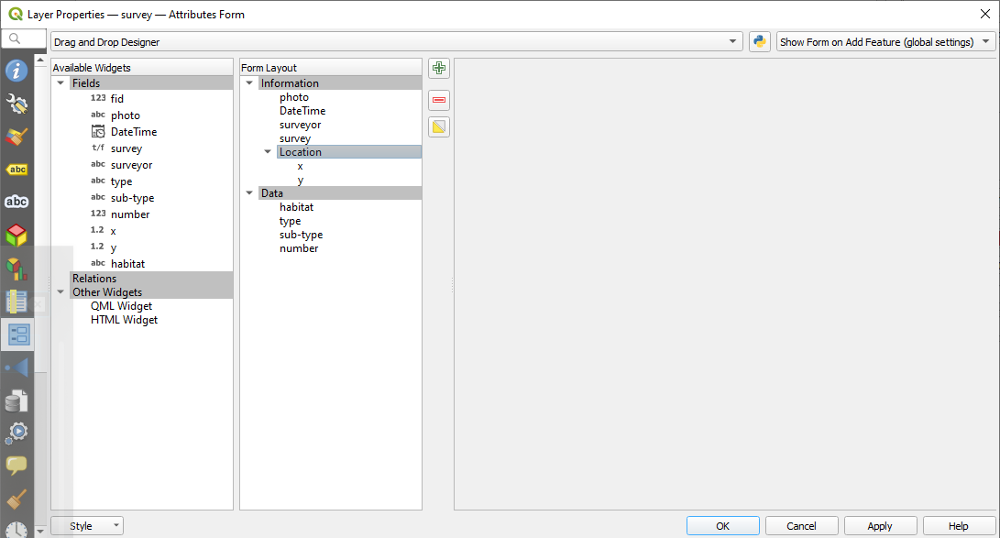
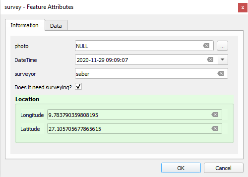
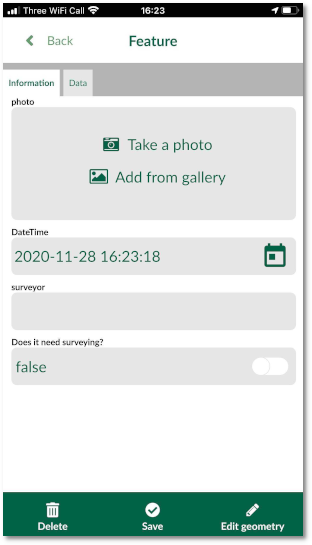

# Form layout
If your form contains more than a handful number of fields, it becomes to difficult to navigate and enter or view the data. In this section, we can change the layout in QGIS.

## QGIS

To set form layout, we are going to use **Drag-n-Drop** designer:

  - Download and open [this example project](https://public.cloudmergin.com/projects/documentation/form_setup/tree) in QGIS
  - From the layer panel, right-click on **survey** layer and select **Properties**
  - In the new window, select **Attributes form**

  - From the top of the drop-down menu, select **Drag-n-Drop Designer**

We can add multiple groups and move **Fields** from the left column to the newly generated groups.

In this example, we have created the following three groups:
  - Information
  - Data
  - Location

The form will appear as below in QGIS now:

## Input

To view the new layout in Input:

- Open Input on your device and from **Projects** > **Explore** download **documentation\form_setup**

- Open the project
- Select **Record** and add a point
- The form will appear and you can see 3 tabs in your forms

