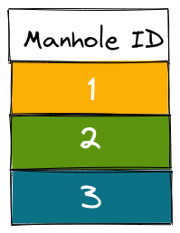
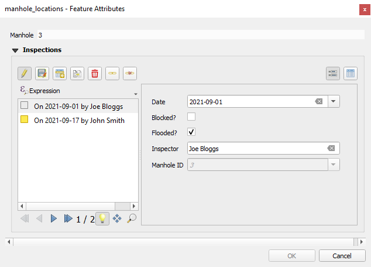

## 1-N relations

It is often the case that you have a set of spatial features and you want to record some parameters every now and then. For example, there is a GIS layer representing the manholes and the surveyors carry out regular inspections of the manholes. Instead of duplicating the manhole layer and recording each inspection, you can create a non-spatial table and store each inspection as a new line.

The image below shows the manholes locations:

The manhole point layer has the following attribute table:

In a separate table (which is non-spatial), we can record the inspections:

In QGIS, we are using the **Manhole ID** from the point layer and the inspection table, to create a 1-N relationship between the two tables.

Another example is when you try to capture multiple photos for a single feature.

In the sections below, you can see how this type of relations can be set up in QGIS and utilised in the Input app.

### Project preparation in QGIS

See the example projects:
- Assigning multiple inspections to a single feature: [example project](public.cloudmergin.com/documentation/forms_one-to-many-relations)
- Adding multiple photos to a single feature: [example project](public.cloudmergin.com/documentation/documentation/forms_multiple_photos)

To configure 1-N relations in QGIS:
- From the main menu, select **Projects** > **Properties ...**
- In the new window, select the **Relations** tab
- Select **Add Relation** to create a new one
- A new window will appear, where we can define the parent and child layers and the fields to link the two layers:
  - For **Name** type **Inspection**
  - For the **Referenced(parent)** layer, select **manhole_locations**
  - For **Field 1** of the **Referenced(parent)** layer, select **Manhole**
  - For the **Referencing(child)** layer, select **inspections**
  - For **Field 1** of the **Referencing(child)** layer, select **Manhole ID**

This should now allow you to add multiple inspections for each manhole location (**manhole_locations** point layer). The inspections records will be stored in the **inspections** table.

When you open the form for an existing record in the  **manhole_locations** point layer, you should be able to see the existing inspection records and optionally add, delete or edit the records:

The same project when you open add inspection to a manhole in Input will look like the image below:

### Link multiple photos to a single feature

Another use-case for having multiple photos linked to a single feature is using 1-N relation.

To set up a project in QGIS, similar to the previous example, we need a unique field to link the following two tables:
- Survey layer (containing spatial information)
- A non-spatial table containing path to the photos

The key part when linking the above to table is to avoid using **FID** field in the GeoPackage. Mergin uses the FID to consolidate changes and therefore can change the FIDs. This will result in having photos linked to the incorrect feature on the map.

For that, we can create a new field and use the **uuid()** as the default value. To learn more about how this can be configured, you can see the [example project](public.cloudmergin.com/documentation/documentation/forms_multiple_photos).

Input detects the type of 1-N relation is for "Attachment" widget and displays the image viewer for the relations.

