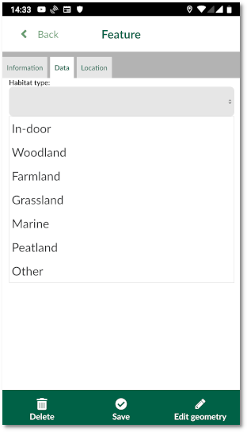

# Drop-down (value map)
To present the options for a field as a drop-down menu in the form, you can use **value map** widget in QGIS.

## QGIS

To set up a value map widget:

  - Download and open [this example project](https://public.cloudmergin.com/projects/documentation/form_setup/tree) in QGIS
  - From the layer panel, right-click on **survey** layer and select **Properties**
  - In the new window, select **Attributes form**

  - Select **habitat** field under the right column (**Available Widgets**)
  - Under the **Widget Display**:
  - Under **General**, for **Alias** type **Habitat type:**
  - Under **Widget Type** section:
    - From the drop-down menu, select **Value Map**
    - Set the edit widget to **Slider**
    - For **Value** and **Description** part type the following values: In-door, Woodland, Farmland, Grassland, Marine, Peatland and Other.

Ensure to save and synchronise your project.

## Input

To use the drop-down widget in the form from Input:

- Open Input on your device and from **Projects** > **Explore** download **documentation\form_setup**
- Open the project
- Select **Record** and add a point
- The form will appear
- Under **Data** tab, you can select the **Habitat type:** from the drop-down menu:

**Note:** when you have a large list, Input will open the values in a full screen mode, where you can also search for the values.

