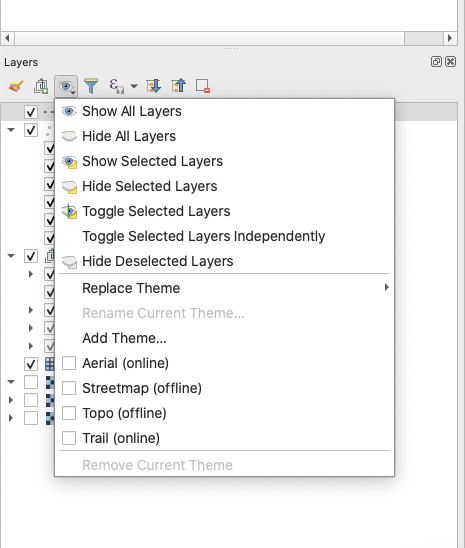

<!--- IMPORTANT: This permlink is referenced from InputApp -->

# Setup QGIS Map Themes

- Open QGIS Desktop with you QGIS Project 
- In the Layers Panel, click on "Manage Map Themes" (eye-icon)

- Add new themes or replace existing themes.
- Save the project 
- Resync the project back to your device
